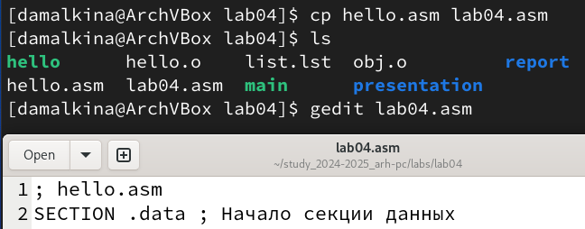

---
## Front matter
title: "Лабораторная работа №4."
subtitle: "Создание и процесс
обработки программ на языке ассемблера NASM"
author: "Дарья Александровна Малкина"

## Generic otions
lang: ru-RU
toc-title: "Содержание"

## Bibliography
bibliography: bib/cite.bib
csl: pandoc/csl/gost-r-7-0-5-2008-numeric.csl

## Pdf output format
toc: true # Table of contents
toc-depth: 2
lof: true # List of figures
lot: true # List of tables
fontsize: 12pt
linestretch: 1.5
papersize: a4
documentclass: scrreprt
## I18n polyglossia
polyglossia-lang:
  name: russian
  options:
	- spelling=modern
	- babelshorthands=true
polyglossia-otherlangs:
  name: english
## I18n babel
babel-lang: russian
babel-otherlangs: english
## Fonts
mainfont: IBM Plex Serif
romanfont: IBM Plex Serif
sansfont: IBM Plex Sans
monofont: IBM Plex Mono
mathfont: STIX Two Math
mainfontoptions: Ligatures=Common,Ligatures=TeX,Scale=0.94
romanfontoptions: Ligatures=Common,Ligatures=TeX,Scale=0.94
sansfontoptions: Ligatures=Common,Ligatures=TeX,Scale=MatchLowercase,Scale=0.94
monofontoptions: Scale=MatchLowercase,Scale=0.94,FakeStretch=0.9
mathfontoptions:
## Biblatex
biblatex: true
biblio-style: "gost-numeric"
biblatexoptions:
  - parentracker=true
  - backend=biber
  - hyperref=auto
  - language=auto
  - autolang=other*
  - citestyle=gost-numeric
## Pandoc-crossref LaTeX customization
figureTitle: "Рис."
tableTitle: "Таблица"
listingTitle: "Листинг"
lofTitle: "Список иллюстраций"
lotTitle: "Список таблиц"
lolTitle: "Листинги"
## Misc options
indent: true
header-includes:
  - \usepackage{indentfirst}
  - \usepackage{float} # keep figures where there are in the text
  - \floatplacement{figure}{H} # keep figures where there are in the text
---

# Цель работы

Освоение процедуры компиляции и сборки программ, написанных на ассемблере NASM.

# Выполнение лабораторной работы

1. Создаем каталог для работы с программами на языке ассемблера NASM, переходим в созданный каталог и создаем текстовый файл с именем hello.asm:

{#fig:001 width=70%}

Открываем этот файл с помощью текстового редактора gedit и вводим в него текст программы:

{#fig:002 width=70%}

2. Преобразовываем текст программы из файла hello.asm в объектный код, который запишется в файл hello.o:

{#fig:003 width=70%}

3. Скомпилируем исходный файл hello.asm в obj.o с помощью команды nasm -o obj.o -f elf -g -l list.lst hello.asm:

{#fig:004 width=70%}

4. Чтобы получить исполняемую программу, передаём объектный файл на обработку компоновщику LD:

{#fig:005 width=70%}

С помощью ключа -o задаём имя создаваемого исполняемого файла - команда ld -m elf_i386 obj.o -o main:

{#fig:006 width=70%}

5. Запускаем файл:

{#fig:007 width=70%}

# Задание для самостоятельной работы

1. В каталоге lab04 создём копию файла hello.asm с именем lab4.asm и с помощью текстового редактора вносим свои изменения в текст программы в
файле lab4.asm:

{#fig:008 width=70%}
{#fig:009 width=70%}

2. Транслируем полученный текст программы lab4.asm в объектный файл, после выполняем компоновку объектного файла и запускаем получившийся исполняемый файл:

{#fig:010 width=70%}
{#fig:011 width=70%}
{#fig:012 width=70%}

4. Загружаем файлы на Github

# Выводы

В ходе работы мы познакомились с ассемблером NASM и были получены практические навыки работы с ним. А также были освоены основы компиляции и сборки программ на языке ассемблера NASM.

::: {#refs}
:::
